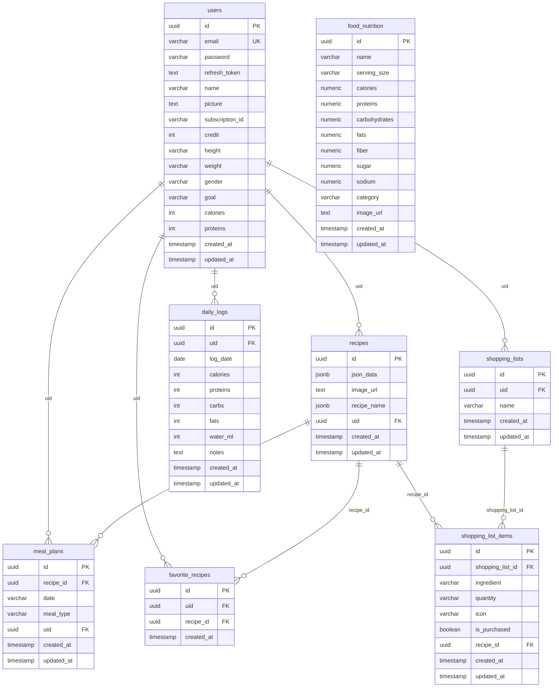

# Phân Tích & Thiết Kế Database — Diet Planner Server

> **Stack**: NestJS 11 · TypeORM 0.3 · PostgreSQL 17  
> **Cập nhật**: 2026-05-15

---

## Mục lục

1. [Tổng quan kiến trúc](#1-tổng-quan-kiến-trúc)
2. [Schema hiện tại](#2-schema-hiện-tại)
3. [Schema đề xuất mở rộng](#3-schema-đề-xuất-mở-rộng)
4. [ER Diagram](#4-er-diagram)
5. [Data Flow các tính năng chính](#5-data-flow-các-tính-năng-chính)

---

## 1. Tổng quan kiến trúc

### Mô hình hệ thống

```
┌─────────────────────────────────┐
│    React Native (Expo)          │
│    diet-planner-react-native    │
└──────────────┬──────────────────┘
               │ HTTP/REST (JWT Bearer)
               ▼
┌─────────────────────────────────┐
│    NestJS REST API              │
│    diet-planner-server          │
│    ─────────────────────────    │
│    Auth Module (JWT + bcrypt)   │
│    Users Module                 │
│    Recipes Module               │
│    Meal Plans Module            │
│    [Shopping List Module] *     │
│    [Favorites Module]      *    │
│    [Daily Log Module]      *    │
└──────────────┬──────────────────┘
               │ TypeORM
               ▼
┌─────────────────────────────────┐
│    PostgreSQL 17                │
│    (Docker / hosted)            │
└─────────────────────────────────┘

* = Chưa implement, đề xuất mở rộng
```

### Công nghệ

| Thành phần | Công nghệ | Ghi chú |
|---|---|---|
| Framework | NestJS 11 | Modular, DI container |
| ORM | TypeORM 0.3 | Decorator-based entities |
| Database | PostgreSQL 17 | JSONB cho dữ liệu linh hoạt |
| Authentication | Passport.js + JWT | Access token 15m, Refresh token 7d |
| Password hashing | bcrypt (12 rounds) | Stored hash trong DB |
| API Docs | Swagger/OpenAPI | Endpoint `/api` |
| Container | Docker Compose | postgres + nestjs services |

### Cấu trúc module

```
src/
├── auth/          # Register, Login, Refresh token
├── users/         # Profile, Preferences, Health goals
├── recipes/       # CRUD công thức (lưu từ AI)
├── meal-plans/    # Lập kế hoạch bữa ăn theo ngày
└── [Modules mới theo roadmap]
```

---

## 2. Schema hiện tại

### 2.1 Bảng `users`

Lưu thông tin tài khoản và hồ sơ sức khỏe của người dùng.

```sql
CREATE TABLE users (
  id              UUID PRIMARY KEY DEFAULT gen_random_uuid(),
  email           VARCHAR NOT NULL UNIQUE,
  password        VARCHAR NOT NULL,           -- bcrypt hash
  refresh_token   TEXT,                       -- hashed refresh JWT
  name            VARCHAR,
  picture         TEXT,                       -- URL ảnh đại diện
  subscription_id VARCHAR,                    -- ID gói đăng ký (future)
  credit          INTEGER NOT NULL DEFAULT 0, -- số lần dùng AI
  height          VARCHAR,                    -- vd: "170" (cm)
  weight          VARCHAR,                    -- vd: "65" (kg)
  gender          VARCHAR,                    -- "Male" | "Female"
  goal            VARCHAR,                    -- "Weight Loss" | "Muscle Gain" | "Healthy Lifestyle"
  calories        INTEGER,                    -- mục tiêu calo/ngày (tính bởi AI)
  proteins        INTEGER,                    -- mục tiêu protein/ngày (tính bởi AI)
  created_at      TIMESTAMP DEFAULT NOW(),
  updated_at      TIMESTAMP DEFAULT NOW()
);
```

**Ghi chú thiết kế:**
- `height`, `weight` lưu dạng `VARCHAR` để hỗ trợ đơn vị linh hoạt (cm/ft, kg/lbs) từ phía client
- `refresh_token` lưu hash (không phải token thô) — tăng bảo mật khi DB bị lộ
- `credit` đại diện cho số lần gọi AI còn lại; khởi tạo = 0 (server), = 10 (Convex cũ)
- `calories`, `proteins` là kết quả do AI tính toán dựa trên `weight`, `height`, `gender`, `goal`

**Relationships:**
- `users` → `recipes`: OneToMany (1 user có nhiều recipe)
- `users` → `meal_plans`: OneToMany (1 user có nhiều meal plan)

---

### 2.2 Bảng `recipes`

Lưu công thức được tạo bởi AI, gắn với user.

```sql
CREATE TABLE recipes (
  id          UUID PRIMARY KEY DEFAULT gen_random_uuid(),
  json_data   JSONB NOT NULL,    -- toàn bộ dữ liệu công thức
  image_url   TEXT NOT NULL,     -- URL ảnh công thức (từ AI image gen)
  recipe_name JSONB NOT NULL,    -- tên công thức (có thể là object đa ngôn ngữ)
  uid         UUID NOT NULL REFERENCES users(id) ON DELETE CASCADE,
  created_at  TIMESTAMP DEFAULT NOW(),
  updated_at  TIMESTAMP DEFAULT NOW()
);
```

**Cấu trúc `json_data` (JSONB):**

```json
{
  "recipeName": "Grilled Salmon Bowl",
  "description": "Healthy salmon bowl with vegetables...",
  "calories": 520,
  "cookTime": 25,
  "serveTo": 2,
  "category": ["High Protein", "Keto"],
  "imagePrompt": "grilled salmon on rice with...",
  "ingredients": [
    { "icon": "🐟", "ingredient": "Salmon fillet", "quantity": "200g" },
    { "icon": "🍚", "ingredient": "Brown rice", "quantity": "1 cup" }
  ],
  "steps": [
    "Marinate salmon with olive oil and lemon...",
    "Grill on medium heat for 4 minutes each side..."
  ]
}
```

**Ghi chú thiết kế:**
- Dùng `JSONB` thay vì normalize vì cấu trúc recipe do AI sinh ra có thể thay đổi theo version AI
- `JSONB` hỗ trợ indexing và query theo field con nếu cần sau này
- `recipe_name` tách riêng ra ngoài để query/sort nhanh mà không cần parse toàn bộ `json_data`

---

### 2.3 Bảng `meal_plans`

Gán công thức vào bữa ăn cụ thể theo ngày.

```sql
CREATE TABLE meal_plans (
  id          UUID PRIMARY KEY DEFAULT gen_random_uuid(),
  recipe_id   UUID NOT NULL REFERENCES recipes(id) ON DELETE CASCADE,
  date        VARCHAR NOT NULL,      -- format: "DD/MM/YYYY"
  meal_type   VARCHAR NOT NULL,      -- "breakfast" | "lunch" | "dinner" | "snack"
  uid         UUID NOT NULL REFERENCES users(id) ON DELETE CASCADE,
  created_at  TIMESTAMP DEFAULT NOW(),
  updated_at  TIMESTAMP DEFAULT NOW()
);
```

**Ghi chú thiết kế:**
- `date` lưu dạng `VARCHAR` (kế thừa từ Convex); nên cân nhắc migrate sang `DATE` để query range dễ hơn
- `meal_type` không có constraint `CHECK` — nên thêm hoặc dùng enum khi refactor
- Xóa `recipe` sẽ cascade xóa tất cả `meal_plans` liên quan

---

## 3. Schema đề xuất mở rộng

Các bảng dưới đây được đề xuất dựa trên `FEATURES.md` nhưng **chưa được implement**.

### 3.1 Bảng `favorite_recipes`

Cho phép user đánh dấu công thức yêu thích (Feature: *Favorite recipes*).

```sql
CREATE TABLE favorite_recipes (
  id          UUID PRIMARY KEY DEFAULT gen_random_uuid(),
  uid         UUID NOT NULL REFERENCES users(id) ON DELETE CASCADE,
  recipe_id   UUID NOT NULL REFERENCES recipes(id) ON DELETE CASCADE,
  created_at  TIMESTAMP DEFAULT NOW(),
  UNIQUE (uid, recipe_id)   -- mỗi user chỉ favorite 1 lần
);
```

---

### 3.2 Bảng `shopping_lists`

Header của danh sách mua sắm (Feature: *Shopping List*).

```sql
CREATE TABLE shopping_lists (
  id          UUID PRIMARY KEY DEFAULT gen_random_uuid(),
  uid         UUID NOT NULL REFERENCES users(id) ON DELETE CASCADE,
  name        VARCHAR NOT NULL DEFAULT 'Shopping List',
  created_at  TIMESTAMP DEFAULT NOW(),
  updated_at  TIMESTAMP DEFAULT NOW()
);
```

### 3.3 Bảng `shopping_list_items`

Chi tiết các item trong danh sách mua sắm.

```sql
CREATE TABLE shopping_list_items (
  id               UUID PRIMARY KEY DEFAULT gen_random_uuid(),
  shopping_list_id UUID NOT NULL REFERENCES shopping_lists(id) ON DELETE CASCADE,
  ingredient       VARCHAR NOT NULL,    -- tên nguyên liệu
  quantity         VARCHAR,             -- số lượng, vd: "200g", "2 cups"
  icon             VARCHAR,             -- emoji icon, vd: "🥕"
  is_purchased     BOOLEAN NOT NULL DEFAULT FALSE,
  recipe_id        UUID REFERENCES recipes(id) ON DELETE SET NULL,  -- nguồn gốc từ recipe nào
  created_at       TIMESTAMP DEFAULT NOW(),
  updated_at       TIMESTAMP DEFAULT NOW()
);
```

**Ghi chú**: `recipe_id` nullable — cho phép thêm item thủ công không từ recipe.

---

### 3.4 Bảng `food_nutrition`

Lưu dữ liệu dinh dưỡng của thực phẩm cơ bản (Feature: *Food Nutrition*).

```sql
CREATE TABLE food_nutrition (
  id              UUID PRIMARY KEY DEFAULT gen_random_uuid(),
  name            VARCHAR NOT NULL,
  serving_size    VARCHAR NOT NULL DEFAULT '100g',
  calories        NUMERIC(8,2),
  proteins        NUMERIC(8,2),   -- gram
  carbohydrates   NUMERIC(8,2),   -- gram
  fats            NUMERIC(8,2),   -- gram
  fiber           NUMERIC(8,2),   -- gram
  sugar           NUMERIC(8,2),   -- gram
  sodium          NUMERIC(8,2),   -- mg
  category        VARCHAR,        -- "Protein", "Carb", "Vegetable", "Fruit", v.v.
  image_url       TEXT,
  created_at      TIMESTAMP DEFAULT NOW(),
  updated_at      TIMESTAMP DEFAULT NOW()
);

CREATE INDEX idx_food_nutrition_name ON food_nutrition USING GIN (to_tsvector('english', name));
```

**Ghi chú**: Bảng này có thể được seed từ nguồn dinh dưỡng công khai (USDA FoodData, OpenFoodFacts).

---

### 3.5 Bảng `daily_logs`

Ghi nhận lượng calories và macro thực tế mỗi ngày (Feature: *Dashboard & Analytics / Progress Tracking*).

```sql
CREATE TABLE daily_logs (
  id            UUID PRIMARY KEY DEFAULT gen_random_uuid(),
  uid           UUID NOT NULL REFERENCES users(id) ON DELETE CASCADE,
  log_date      DATE NOT NULL,
  calories      INTEGER NOT NULL DEFAULT 0,   -- tổng calo đã ăn
  proteins      INTEGER NOT NULL DEFAULT 0,   -- gram protein đã ăn
  carbs         INTEGER NOT NULL DEFAULT 0,   -- gram carb đã ăn
  fats          INTEGER NOT NULL DEFAULT 0,   -- gram fat đã ăn
  water_ml      INTEGER NOT NULL DEFAULT 0,   -- ml nước đã uống
  notes         TEXT,
  created_at    TIMESTAMP DEFAULT NOW(),
  updated_at    TIMESTAMP DEFAULT NOW(),
  UNIQUE (uid, log_date)    -- mỗi ngày chỉ có 1 log per user
);

CREATE INDEX idx_daily_logs_uid_date ON daily_logs (uid, log_date DESC);
```

---

## 4. ER Diagram



---

## 5. Data Flow các tính năng chính

### 5.1 Authentication — Register & Login

```
[Client]                        [NestJS API]                    [PostgreSQL]
   │                                │                                │
   │── POST /auth/register ────────>│                                │
   │   { email, password, name }    │                                │
   │                                │── SELECT * FROM users ────────>│
   │                                │   WHERE email = ?              │
   │                                │<─ (empty) ─────────────────────│
   │                                │── bcrypt.hash(password, 12)    │
   │                                │── INSERT INTO users ──────────>│
   │                                │<─ user record ─────────────────│
   │                                │── sign accessToken (15m)       │
   │                                │── sign refreshToken (7d)       │
   │                                │── bcrypt.hash(refreshToken)    │
   │                                │── UPDATE users SET             │
   │                                │   refresh_token = hash ───────>│
   │<─ { accessToken, refreshToken }│                                │
   │                                │                                │
   │── POST /auth/login ───────────>│                                │
   │   { email, password }          │                                │
   │                                │── SELECT * FROM users ────────>│
   │                                │   WHERE email = ?              │
   │                                │<─ user record ─────────────────│
   │                                │── bcrypt.compare(pw, hash)     │
   │<─ { accessToken, refreshToken }│                                │
```

**Refresh Token Flow:**
```
[Client]                        [NestJS API]                    [PostgreSQL]
   │── POST /auth/refresh ─────────>│                                │
   │   { refreshToken }             │── verify JWT signature         │
   │                                │── SELECT refresh_token ───────>│
   │                                │   FROM users WHERE id = ?      │
   │                                │<─ hashed_refresh_token ────────│
   │                                │── bcrypt.compare(token, hash)  │
   │                                │── sign new accessToken         │
   │                                │── sign new refreshToken        │
   │                                │── UPDATE refresh_token hash ──>│
   │<─ { accessToken, refreshToken }│                                │
```

---

### 5.2 Onboarding & User Preferences

```
[Client]                        [NestJS API]                    [AI Service]        [PostgreSQL]
   │                                │                                │                    │
   │── GET /users/me ──────────────>│                                │                    │
   │   (JWT Bearer)                 │── SELECT * FROM users ─────────────────────────────>│
   │<─ user (no weight/height) ─────│                                │                    │
   │                                │                                │                    │
   │   [User nhập weight/height/    │                                │                    │
   │    gender/goal]                │                                │                    │
   │                                │                                │                    │
   │── PUT /users/preferences ─────>│                                │                    │
   │   { weight, height,            │── Gọi AI (OpenRouter)                               │
   │     gender, goal }             │   với CALORIES_PROMPT ────────>│                    │
   │                                │<─ { calories, proteins } ──────│                    │
   │                                │── UPDATE users SET ─────────────────────────────────>│
   │                                │   weight, height, gender,      │                    │
   │                                │   goal, calories, proteins     │                    │
   │<─ updated user ────────────────│                                │                    │
```

---

### 5.3 AI Recipe Generation & Save

```
[Client]                  [NestJS API]              [OpenRouter AI]      [AI Image Gen]   [PostgreSQL]
   │                           │                          │                    │               │
   │── POST /recipes/generate  │                          │                    │               │
   │   { prompt }              │── GENERATE_RECIPE_OPTION_PROMPT               │               │
   │                           │   + user preferences ───>│                    │               │
   │                           │<─ [3 recipe options] ────│                    │               │
   │<─ [3 recipe options] ─────│                          │                    │               │
   │                           │                          │                    │               │
   │   [User chọn 1 option]    │                          │                    │               │
   │                           │                          │                    │               │
   │── POST /recipes/generate  │                          │                    │               │
   │   { selectedOption }      │── GENERATE_COMPLETE_     │                    │               │
   │                           │   RECIPE_PROMPT ─────────>│                   │               │
   │                           │<─ full recipe JSON ──────│                    │               │
   │                           │── GenerateRecipeImage ──────────────────────>│               │
   │                           │<─ imageUrl ─────────────────────────────────│               │
   │                           │── INSERT INTO recipes ───────────────────────────────────>│
   │                           │   { json_data, image_url,│                    │               │
   │                           │     recipe_name, uid }   │                    │               │
   │                           │── UPDATE users           │                    │               │
   │                           │   SET credit = credit-1 ────────────────────────────────>│
   │<─ saved recipe ───────────│                          │                    │               │
```

---

### 5.4 Meal Plan Management

```
[Client]                        [NestJS API]                    [PostgreSQL]
   │                                │                                │
   │── GET /meal-plans?date=...  ──>│                                │
   │   (JWT Bearer)                 │── SELECT mp.*, r.json_data,  ─>│
   │                                │   r.image_url FROM meal_plans mp│
   │                                │   JOIN recipes r ON            │
   │                                │   mp.recipe_id = r.id          │
   │                                │   WHERE mp.uid = ? AND         │
   │                                │   mp.date = ?                  │
   │<─ [{ mealPlan, recipe }] ──────│<─ joined result ───────────────│
   │                                │                                │
   │── POST /meal-plans ───────────>│                                │
   │   { recipeId, date,            │── INSERT INTO meal_plans ─────>│
   │     mealType }                 │── RETURN new record            │
   │<─ created meal plan ───────────│<─ ─────────────────────────────│
   │                                │                                │
   │── DELETE /meal-plans/:id ─────>│                                │
   │                                │── DELETE FROM meal_plans ─────>│
   │                                │   WHERE id = ? AND uid = ?     │
   │<─ 204 No Content ──────────────│                                │
```

**Today's Progress Calculation** (Home screen):
```
SELECT 
  COALESCE(SUM((r.json_data->>'calories')::int), 0) AS total_calories,
  COUNT(*) AS meal_count
FROM meal_plans mp
JOIN recipes r ON mp.recipe_id = r.id
WHERE mp.uid = $1 AND mp.date = $2
```

---

### 5.5 Shopping List

```
[Client]                        [NestJS API]                    [PostgreSQL]
   │                                │                                │
   │── POST /shopping-lists ───────>│                                │
   │   { name }                     │── INSERT INTO shopping_lists ─>│
   │<─ { id, name } ───────────────>│<─ ─────────────────────────────│
   │                                │                                │
   │── POST /shopping-lists/:id     │                                │
   │   /items (from recipe)         │── SELECT ingredients FROM ────>│
   │   { recipeId }                 │   recipes WHERE id = ?         │
   │                                │<─ recipe.json_data ────────────│
   │                                │── parse ingredients[]          │
   │                                │── INSERT INTO                  │
   │                                │   shopping_list_items ────────>│
   │                                │   (bulk insert)                │
   │<─ [items] ─────────────────────│<─ ─────────────────────────────│
   │                                │                                │
   │── PATCH /shopping-lists/items  │                                │
   │   /:itemId                     │                                │
   │   { isPurchased: true }        │── UPDATE shopping_list_items ─>│
   │                                │   SET is_purchased = true      │
   │<─ updated item ────────────────│<─ ─────────────────────────────│
```

---

## Tổng kết

### Bảng hiện có (3 bảng)

| Bảng | Mô tả | Status |
|---|---|---|
| `users` | Tài khoản, profile, health goals | ✅ Implemented |
| `recipes` | Công thức AI-generated (JSONB) | ✅ Implemented |
| `meal_plans` | Gán recipe vào bữa ăn theo ngày | ✅ Implemented |

### Bảng đề xuất mở rộng (5 bảng)

| Bảng | Tính năng tương ứng | Priority |
|---|---|---|
| `favorite_recipes` | Favorite Recipes (FEATURES §9) | Medium |
| `shopping_lists` | Shopping List (FEATURES §6) | High |
| `shopping_list_items` | Shopping List (FEATURES §6) | High |
| `food_nutrition` | Food Nutrition (FEATURES §5) | Medium |
| `daily_logs` | Dashboard & Analytics (FEATURES §8) | High |

### Lưu ý kỹ thuật

1. **Date format**: Cột `date` trong `meal_plans` hiện là `VARCHAR ("DD/MM/YYYY")` — nên migrate sang kiểu `DATE` để hỗ trợ range queries (progress analytics)
2. **JSONB indexing**: Thêm GIN index cho `recipes.json_data` nếu cần filter theo `category` hoặc `calories`
3. **Migrations**: Hiện dùng `synchronize: true` (dev only) — cần setup TypeORM migrations trước production deploy
4. **Credit system**: Cột `credit` trong `users` dùng để rate-limit AI calls — cần thêm logic deduct/topup khi implement subscription
